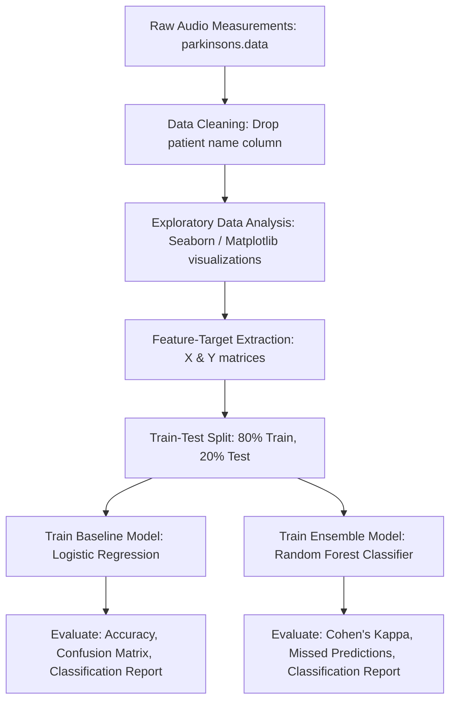

# Parkinson's Disease Predictor

An advanced machine learning classifier designed to detect the presence of Parkinson's Disease using biomedical voice measurements. By analyzing non-invasive acoustic features (e.g., vocal frequency, jitter, shimmer, noise ratios), the system classifies patients as healthy or diagnosed, offering a digital health screening tool.

---

## 🔬 Clinical Context & Domain Knowledge

Parkinson's Disease (PD) is a progressive neurodegenerative disorder that severely impacts motor functions, including speech production. Vocal impairment (dysphonia)—characterized by breathiness, hoarseness, tremor, and reduced volume—often serves as one of the earliest clinical indicators of PD.

This project implements machine learning models to detect PD from voice recordings by analyzing key acoustic features:

### Vocal Frequency Features
* **MDVP:Fo (Hz):** Average fundamental vocal frequency.
* **MDVP:Fhi (Hz):** Maximum fundamental vocal frequency.
* **MDVP:Flo (Hz):** Minimum fundamental vocal frequency.

### Amplitude & Frequency Variation (Jitter & Shimmer)
* **Jitter (%, Absolute, RAP, PPQ, DDP):** Measures of short-term variations in fundamental frequency. PD patients often exhibit higher vocal frequency instability (higher jitter).
* **Shimmer (dB, APQ3, APQ5, APQ, DDA):** Measures of short-term variations in vocal amplitude. Voice volume instability (higher shimmer) is common in PD.

### Noise & Harmonicity Metrics
* **NHR (Noise-to-Harmonics Ratio) & HNR (Harmonics-to-Noise Ratio):** Estimates the ratio of noise to harmonic components in the voice. Voice breathiness leads to an elevated NHR and depleted HNR.

### Non-linear Dynamical & Complexity Metrics
* **RPDE (Recurrence Period Density Entropy) & D2 (Correlation Dimension):** Measures of voice signal complexity and chaotic behavior.
* **DFA (Detrended Fluctuation Analysis):** Quantifies the fractal scaling properties of the speech signal.
* **PPE (Pitch Period Entropy):** A non-linear measure of fundamental frequency variation, highly sensitive to Parkinsonian dysphonia.

---

## 🛠️ Tech Stack

* **Core Language:** Python 3.x
* **Data Processing:** Pandas, NumPy
* **Scientific Computing & ML:** Scikit-Learn
* **Data Visualization:** Matplotlib, Seaborn

---

## 📐 Architecture & Workflow

The classification pipeline is structured as follows:



---

## 📊 Model Evaluation & Comparison

Two classifier architectures are implemented and compared:

### 1. Baseline Model: Logistic Regression
A linear classification algorithm used to establish a performance baseline:
* **Train Accuracy:** ~87.8%
* **Test Accuracy:** ~84.6%

### 2. Ensemble Model: Random Forest Classifier
An ensemble learning method consisting of multiple decision trees to handle non-linear feature interactions and resist overfitting:
* **Train Accuracy:** 100.0% (perfect fit on training data)
* **Test Accuracy:** ~92.3% (excellent generalization)
* **Wrong Predictions:** Only 3 out of 39 test samples misclassified.
* **Cohen's Kappa Score:** `0.771` (indicating substantial agreement and highly reliable classifications).

---

## 💻 Setup & Usage

### Prerequisites
Make sure you have Python 3 and the required libraries installed:
```bash
pip install pandas numpy scikit-learn matplotlib seaborn
```

### Dataset Structure
The dataset file `parkinsons.data` must be present in the project root:
* **Instances:** 195 recordings from 31 subjects (23 diagnosed with Parkinson's, 8 healthy).
* **Target Label:** `status` column (1 = Parkinson's, 0 = Healthy).

### Running the Project
Open the Jupyter notebook to step through the dataset ingestion, data visualization, feature splitting, model training, and performance metrics evaluation:
```bash
jupyter notebook Project_53_Parkinson's_Disease_Predictor.ipynb
```

---

## 📊 Key Visualizations Included
* **Target Balance Histograms:** Visualizes the distribution of healthy vs. diagnosed patients.
* **Feature vs. Target Bar Plots:** Plots feature variables like NHR and RPDE against patient status to show statistical differences.
* **Clinical Feature Correlation Matrix:** A subplots grid mapping out distributions of various acoustic frequencies and dimensions.
